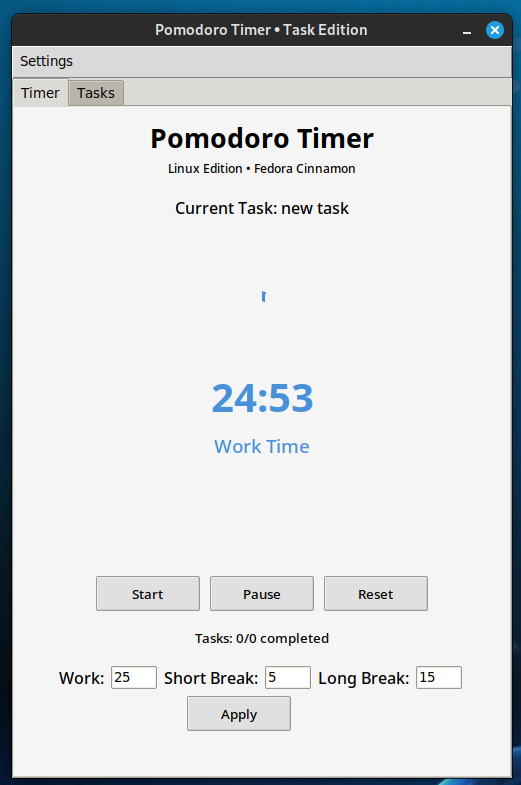

# Pomodoro Timer with Task Management



A productivity application combining the Pomodoro technique with task management, designed for Linux (Fedora Cinnamon) with a clean, minimalist interface.

## Features

- **Pomodoro Timer**
  - 25-minute work sessions
  - 5-minute short breaks
  - 15-minute long breaks after 4 sessions
  - Visual circular progress indicator
  - Configurable timer durations

- **Task Management**
  - Add/edit/delete tasks
  - Mark tasks as completed
  - Set current focus task
  - Task completion statistics
  - Persistent task storage

- **Productivity Tools**
  - Break reminders (posture/stretch alerts)
  - Sound notifications
  - Visual completion tracking
  - Session statistics

## Installation

### Requirements
- Python 3.x
- Tkinter
- Fedora/Cinnamon (or compatible Linux distro)

```bash
# Clone repository
git clone https://github.com/yourusername/pomodoro-timer.git
cd pomodoro-timer

# Install dependencies
sudo dnf install python3-tkinter alsa-utils pulseaudio-utils libnotify

# Run the application
python3 pomodoro.py #or ./pomodoro.py
```

## Usage

1. **Timer Tab**:
   - Start/Pause/Reset timer
   - View current task
   - See completion progress
   - Adjust timer settings

2. **Tasks Tab**:
   - Add new tasks with `Enter task...` placeholder
   - Set current task (marks as complete)
   - Delete tasks
   - View completion statistics

3. **Menu**:
   - Toggle break reminders
   - Configure notification sounds

## Configuration

Modify timer durations in the Settings section:
- Work time (default: 25 min)
- Short break (default: 5 min) 
- Long break (default: 15 min)

Choose notification sounds:
- System beep
- Bell sound
- Full alert (visual+audio)

## Troubleshooting

**Sound not working?**
```bash
sudo dnf install alsa-utils pulseaudio-utils
```

**Missing fonts?**
```bash
sudo dnf install google-noto-sans-fonts
```

**Window not displaying properly?**
Try running with basic theme:
```python
self.style.theme_use("default")  # Change in code
```

## License

MIT License - Free for personal and commercial use

---

*Adapt the Pomodoro durations and notification preferences to match your workflow!*
